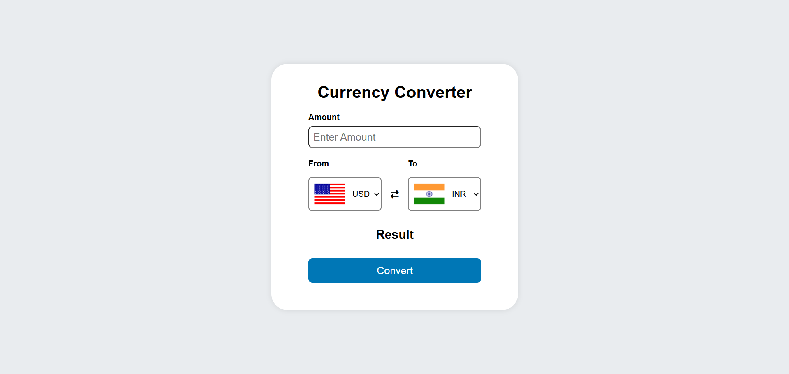
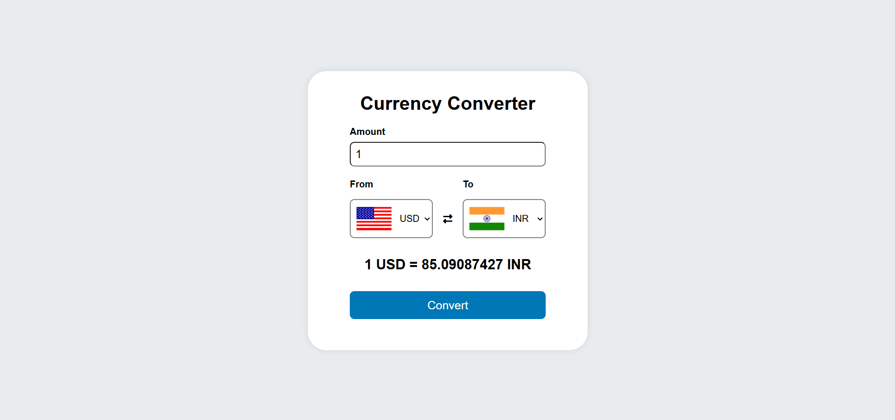

# 💱 Currency Converter

A simple and interactive web application to convert currencies in real-time using the latest exchange rates.

---

## 🚀 Features

- 🌐 **Supports multiple currencies**
- 🔄 **Real-time exchange rates**
- 🖥️ **User-friendly interface**
- 📱 **Responsive design for all devices**

---

## 🛠️ Technologies Used

- **HTML5**
- **CSS3**
- **JavaScript**
- **[Exchange Rate API](https://exchangerate-api.com/)**

---

## 📦 Installation

1. **Clone the repository:**
    ```bash
    git clone https://github.com/your-username/currency-converter.git
    ```
2. **Navigate to the project directory:**
    ```bash
    cd currency-converter
    ```
3. **Open `index.html` in your browser.**

---

## 📝 Usage

1. Select the source and target currencies.
2. Enter the amount to convert.
3. Click **Convert** to see the result instantly.

---

## 📸 Screenshots




---

## 🤝 Contributing

Contributions are welcome! Please open an issue or submit a pull request.

---

## 📄 License

This project is licensed under the [MIT License](LICENSE).

---

> Made with ❤️ for learning and currency enthusiasts!